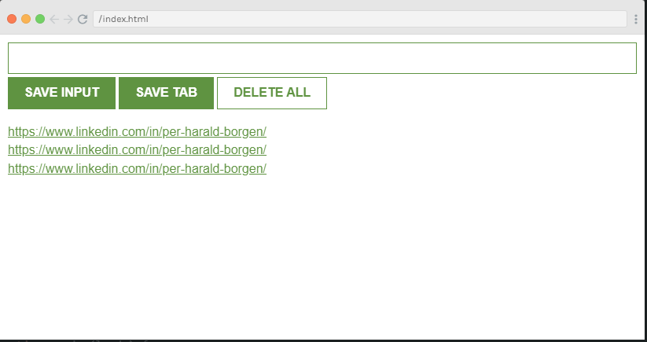

# Project: Leads Tracker Google Chrome Extension

## Description:
In this project, I created a Google Chrome Browser extension named ""Leads Tracker"" to track the websites.

## Features:
Using this extension, users can
- save any url of websites that visit via explicitly adding url and then save
- can directly save url of any active window by clicking on ""save tab"" button
- delete all urls
- urls remain persistent even your refresh the window

## Output:

Happy Coding!
